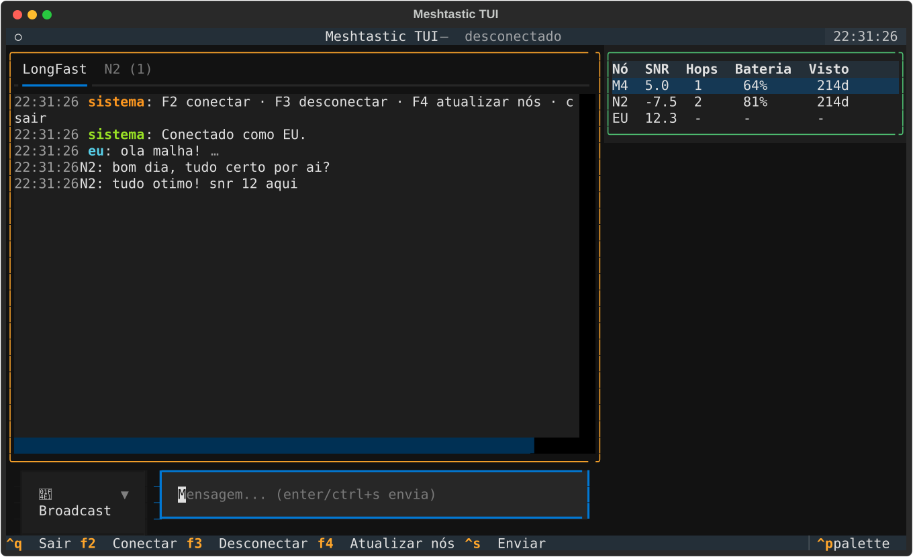

# mesh-tui

A TUI (terminal UI) for [Meshtastic](https://meshtastic.org) networks, built on the
official [Python SDK](https://github.com/meshtastic/python) and the
[Textual](https://textual.textualize.io/) framework.

Connect to a radio over USB or TCP, chat on channels or direct messages, and keep an
eye on the mesh with telemetry and position — all without leaving the terminal.
The UI is available in English and Portuguese (`--lang pt`, or auto-detected from your
locale).



## Features

- **Serial or TCP connection** — port auto-detection or `host[:port]` (default 4403)
- **Automatic reconnection** — exponential backoff (1s → 30s) when the radio or the
  network drops; a manual disconnect (F3) cancels retries
- **Delivery confirmation** — every sent message tracks its ACK/NAK (`✓` delivered,
  `✗` failed, `…` pending)
- **Persistent history** — SQLite at `~/.local/share/mesh_tui/history.db` (honors
  `XDG_DATA_HOME`); everything survives restarts
- **Separate conversations** — one tab per channel (real name, e.g. LongFast) plus
  DM tabs created on demand, with unread badges (`N2 (3)`)
- **Node table** — SNR, hops, battery and last seen, updated live
- **Node details panel** — Enter on the table opens role, hardware, position with
  distance/direction from the local node (e.g. `911 m at SSE`), device telemetry
  (voltage, channel utilization, uptime) and environment metrics (temperature,
  humidity, pressure)
- **New node detection** — log entry + notification when an unknown node joins the mesh
- **Actionable errors** — no serial permission? The message tells you how to fix it
  (`dialout`)
- **Bilingual UI** — English and Portuguese; toggle live with `F7`, or set at
  startup via `--lang` / locale auto-detection

## Requirements

- Python 3.10+
- A Meshtastic radio reachable over USB (serial) or TCP (node with WiFi/ethernet)

## Installation

```bash
git clone <repo> mesh_tui && cd mesh_tui
make install        # creates .venv and installs dependencies + package (editable)
```

Or manually:

```bash
python3 -m venv .venv
.venv/bin/pip install -r requirements.txt
.venv/bin/pip install -e .
```

Serial port permission (Linux): add yourself to the `dialout` group and log in again:

```bash
sudo usermod -aG dialout $USER
```

## Usage

```bash
make run                          # launch the TUI; connect with F2
make run-serial PORT=/dev/ttyUSB0
make run-tcp HOST=192.168.1.50

# or directly
mesh-tui --port /dev/ttyUSB0      # installed entry point
mesh-tui --host 192.168.1.50
mesh-tui --lang pt                # Portuguese UI
```

The UI language defaults to auto-detection from `LANG`/`LC_ALL`; `--lang`
(`en`/`pt`) overrides it.

### Keys

| Key                 | Action                                          |
|---------------------|-------------------------------------------------|
| `F2`                | Connect (serial/TCP dialog)                     |
| `F3`                | Disconnect (cancels automatic reconnection)     |
| `F4`                | Refresh node list                               |
| `F7`                | Toggle UI language (English/Portuguese)         |
| `enter` / `ctrl+s`  | Send message                                    |
| `enter` (table)     | Open details for the selected node              |
| `esc`               | Close dialog/details                            |
| `ctrl+q`            | Quit                                            |

### Conversations

- The **active tab** sets the channel for broadcasts.
- Pick a **Destination** (a specific node) and send to automatically create/switch to
  the DM tab with that node.
- Incoming direct messages create the conversation tab and bump the unread badge.

## Troubleshooting

| Message                                  | Likely cause / fix                                    |
|------------------------------------------|-------------------------------------------------------|
| no permission on the serial port         | `sudo usermod -aG dialout $USER` and log in again     |
| serial port not found                    | check the path (`ls /dev/ttyUSB*`)                    |
| serial port busy                         | close another Meshtastic client using the radio       |
| TCP connection refused                   | check host/port and that the node accepts TCP clients |
| multiple serial ports detected           | pick a specific port instead of auto-detect           |

## Development

```bash
make test        # headless tests (no hardware required)
make check       # tests + import verification
make clean       # remove caches
```

The tests run the full UI with `textual.run_test()` against a simulated Meshtastic
interface — they cover connection, reconnection, ACKs, history, DMs, the details
panel and i18n.

### Architecture

| Module                    | Responsibility                                                |
|---------------------------|---------------------------------------------------------------|
| `mesh_tui/app.py`         | Textual UI: tabs, composer, node table, dialogs, events       |
| `mesh_tui/meshtastic_link.py` | Thread-safe SDK wrapper: connection, pubsub, reconnect, ACKs |
| `mesh_tui/storage.py`     | Persistent SQLite history                                     |
| `mesh_tui/nodeinfo.py`    | Position (haversine/bearing), telemetry and details panel     |
| `mesh_tui/i18n.py`        | English/Portuguese UI strings                                 |

Event flow: the SDK publishes on its own threads → `MeshtasticLink` normalizes into
events (`text`, `node`, `connected`, `disconnected`, `reconnect_failed`, `ack`) → the
app marshals them to the UI thread via `call_from_thread`.

## License

[GPL-3.0](LICENSE) © Adson Alcântara — the same copyleft as the
[Meshtastic Python SDK](https://github.com/meshtastic/python), from which this
project derives.
